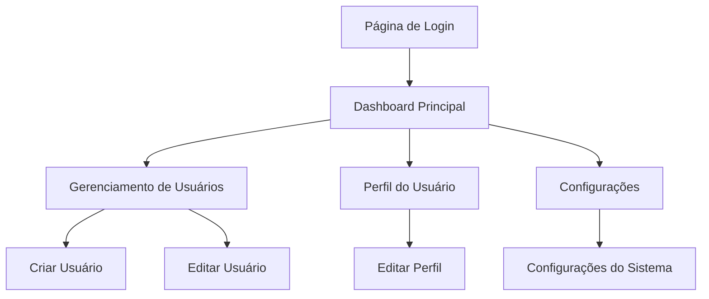

# Documentação de Requisitos do Dashboard HeroUI

## 1. Visão Geral do Produto

Um dashboard administrativo moderno e responsivo construído com React e HeroUI, oferecendo uma interface completa para gerenciamento de usuários e navegação intuitiva. O sistema fornece autenticação segura, navegação lateral colapsável, controles de perfil e notificações, garantindo uma experiência de usuário acessível e profissional.

## 2. Funcionalidades Principais

### 2.1 Papéis de Usuário

| Papel | Método de Registro | Permissões Principais |
|-------|-------------------|----------------------|
| Usuário Comum | Registro por email | Pode visualizar dashboard, editar perfil próprio |
| Administrador | Convite por admin existente | Acesso completo ao CRUD de usuários, configurações do sistema |

### 2.2 Módulo de Funcionalidades

Nosso dashboard consiste nas seguintes páginas principais:
1. **Página de Login**: formulário de autenticação, recuperação de senha
2. **Dashboard Principal**: visão geral, estatísticas, navegação lateral
3. **Gerenciamento de Usuários**: listagem, criação, edição, exclusão de usuários
4. **Perfil do Usuário**: edição de dados pessoais, configurações de conta
5. **Configurações**: preferências do sistema, temas, notificações

### 2.3 Detalhes das Páginas

| Nome da Página | Nome do Módulo | Descrição da Funcionalidade |
|----------------|----------------|-----------------------------|
| Login | Formulário de Autenticação | Validar credenciais, redirecionamento seguro, recuperação de senha |
| Login | Registro de Usuário | Criar nova conta, validação de email, termos de uso |
| Dashboard Principal | Header | Exibir perfil do usuário, notificações, menu de configurações |
| Dashboard Principal | Sidebar | Navegação colapsável, menu hierárquico, indicadores de página ativa |
| Dashboard Principal | Área de Conteúdo | Exibir estatísticas, gráficos, cards informativos |
| Dashboard Principal | Footer | Links rápidos, informações de copyright, versão do sistema |
| Gerenciamento de Usuários | Lista de Usuários | Exibir, filtrar, pesquisar usuários com paginação |
| Gerenciamento de Usuários | CRUD de Usuários | Criar, editar, excluir usuários com validação |
| Perfil do Usuário | Edição de Perfil | Atualizar dados pessoais, foto de perfil, preferências |
| Configurações | Configurações Gerais | Alterar tema, idioma, notificações, configurações de segurança |

## 3. Processo Principal

**Fluxo do Usuário Comum:**
1. Acessa página de login → Insere credenciais → Dashboard principal
2. Navega pelo sidebar → Acessa diferentes seções
3. Edita perfil próprio → Configura preferências pessoais

**Fluxo do Administrador:**
1. Login → Dashboard com acesso administrativo
2. Gerencia usuários → Cria/edita/exclui contas
3. Configura sistema → Ajusta configurações globais

## 4. Design da Interface do Usuário

### 4.1 Estilo de Design

- **Cores Primárias e Secundárias**: Azul (#0072f5) como primária, cinza (#71717a) como secundária
- **Estilo de Botões**: Arredondados com efeitos hover suaves, seguindo padrões HeroUI
- **Fonte e Tamanhos**: Inter como fonte principal, tamanhos de 14px a 24px
- **Estilo de Layout**: Design baseado em cards, navegação superior fixa, sidebar colapsável
- **Ícones e Emojis**: Ícones Heroicons, emojis minimalistas para feedback visual

### 4.2 Visão Geral do Design das Páginas

| Nome da Página | Nome do Módulo | Elementos da UI |
|----------------|----------------|----------------|
| Login | Formulário de Autenticação | Card centralizado, campos com validação visual, botão primário azul |
| Dashboard Principal | Header | Barra fixa superior, avatar do usuário, badge de notificações |
| Dashboard Principal | Sidebar | Menu colapsável, ícones coloridos, indicador de página ativa |
| Dashboard Principal | Área de Conteúdo | Grid responsivo, cards com sombras suaves, gráficos interativos |
| Gerenciamento de Usuários | Tabela de Usuários | Tabela responsiva, filtros, paginação, ações por linha |
| Perfil do Usuário | Formulário de Perfil | Layout em duas colunas, upload de imagem, campos agrupados |

### 4.3 Responsividade

O produto é mobile-first com adaptação para desktop, incluindo otimização para interação touch em dispositivos móveis. O sidebar se transforma em menu hambúrguer em telas menores que 768px.
