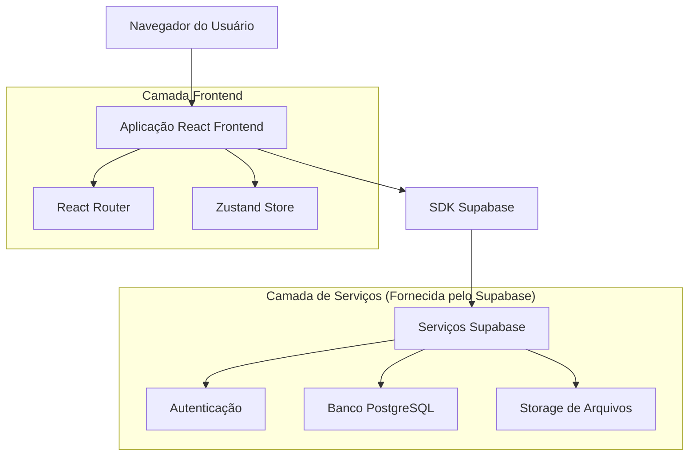
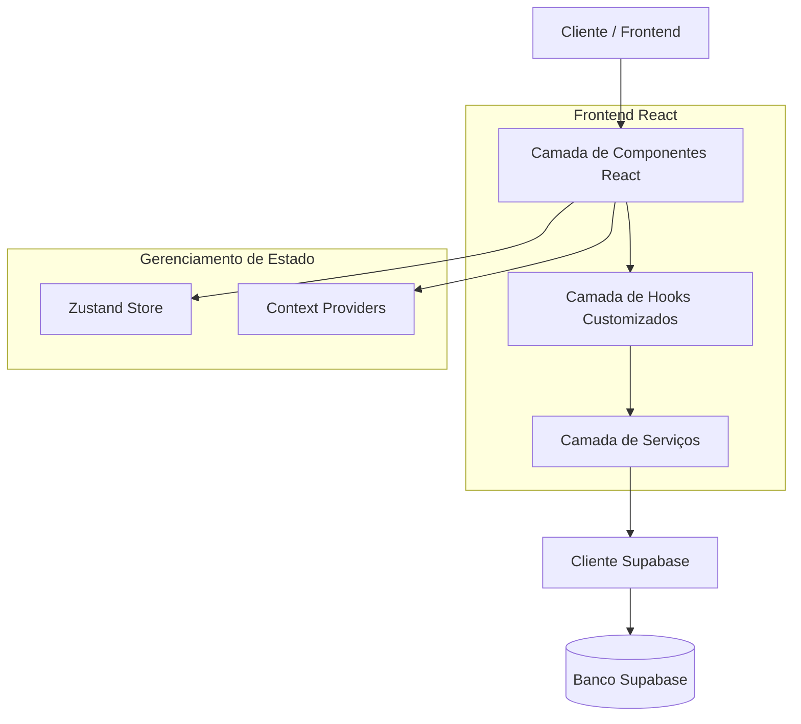
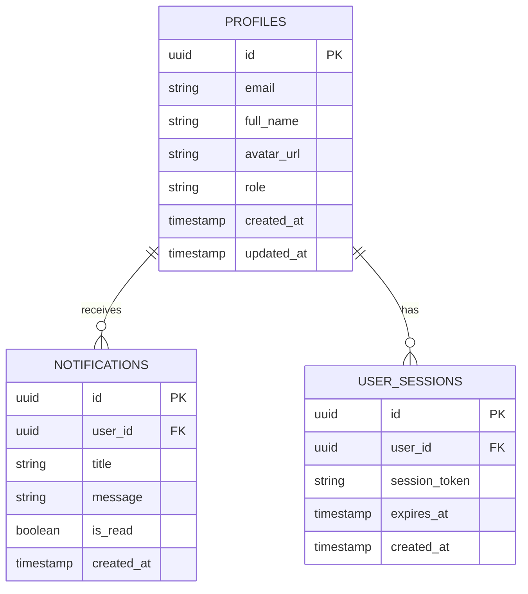

# Documentação de Arquitetura Técnica - Dashboard HeroUI

## 1. Design da Arquitetura



## 2. Descrição da Tecnologia

* Frontend: React\@18 + TypeScript\@5 + HeroUI\@2 + TailwindCSS\@3 + Vite\@5

* Backend: Supabase (PostgreSQL + Auth + Storage)

* Gerenciamento de Estado: Zustand\@4

* Roteamento: React Router\@6

* Validação: Zod\@3

* Ícones: Heroicons\@2

## 3. Definições de Rotas

| Rota            | Propósito                                          |
| --------------- | -------------------------------------------------- |
| /login          | Página de login e registro de usuários             |
| /dashboard      | Dashboard principal com visão geral e estatísticas |
| /users          | Gerenciamento de usuários (listagem e CRUD)        |
| /users/create   | Formulário de criação de novo usuário              |
| /users/:id/edit | Formulário de edição de usuário específico         |
| /profile        | Página de perfil do usuário logado                 |
| /settings       | Configurações do sistema e preferências            |
| /notifications  | Central de notificações do usuário                 |

## 4. Definições de API

### 4.1 API Principal

**Autenticação de usuários**

```
POST /auth/v1/token
```

Request:

| Nome do Parâmetro | Tipo   | Obrigatório | Descrição        |
| ----------------- | ------ | ----------- | ---------------- |
| email             | string | true        | Email do usuário |
| password          | string | true        | Senha do usuário |

Response:

| Nome do Parâmetro | Tipo   | Descrição                    |
| ----------------- | ------ | ---------------------------- |
| access\_token     | string | Token JWT para autenticação  |
| user              | object | Dados do usuário autenticado |

Exemplo:

```json
{
  "email": "usuario@exemplo.com",
  "password": "senhaSegura123"
}
```

**Gerenciamento de usuários**

```
GET /rest/v1/profiles
POST /rest/v1/profiles
PATCH /rest/v1/profiles?id=eq.{id}
DELETE /rest/v1/profiles?id=eq.{id}
```

**Upload de arquivos**

```
POST /storage/v1/object/avatars/{filename}
```

## 5. Diagrama da Arquitetura do Servidor



## 6. Modelo de Dados

### 6.1 Definição do Modelo de Dados



### 6.2 Linguagem de Definição de Dados

**Tabela de Perfis (profiles)**

```sql
-- criar tabela
CREATE TABLE profiles (
    id UUID PRIMARY KEY DEFAULT gen_random_uuid(),
    email VARCHAR(255) UNIQUE NOT NULL,
    full_name VARCHAR(100) NOT NULL,
    avatar_url TEXT,
    role VARCHAR(20) DEFAULT 'user' CHECK (role IN ('user', 'admin')),
    created_at TIMESTAMP WITH TIME ZONE DEFAULT NOW(),
    updated_at TIMESTAMP WITH TIME ZONE DEFAULT NOW()
);

-- criar índices
CREATE INDEX idx_profiles_email ON profiles(email);
CREATE INDEX idx_profiles_role ON profiles(role);

-- políticas de segurança
ALTER TABLE profiles ENABLE ROW LEVEL SECURITY;

-- permitir leitura para usuários autenticados
CREATE POLICY "Usuários podem ver perfis" ON profiles
    FOR SELECT USING (auth.role() = 'authenticated');

-- permitir atualização do próprio perfil
CREATE POLICY "Usuários podem atualizar próprio perfil" ON profiles
    FOR UPDATE USING (auth.uid() = id);

-- permitir acesso completo para admins
CREATE POLICY "Admins têm acesso completo" ON profiles
    FOR ALL USING (
        EXISTS (
            SELECT 1 FROM profiles 
            WHERE id = auth.uid() AND role = 'admin'
        )
    );
```

**Tabela de Notificações (notifications)**

```sql
-- criar tabela
CREATE TABLE notifications (
    id UUID PRIMARY KEY DEFAULT gen_random_uuid(),
    user_id UUID REFERENCES profiles(id) ON DELETE CASCADE,
    title VARCHAR(200) NOT NULL,
    message TEXT NOT NULL,
    is_read BOOLEAN DEFAULT FALSE,
    created_at TIMESTAMP WITH TIME ZONE DEFAULT NOW()
);

-- criar índices
CREATE INDEX idx_notifications_user_id ON notifications(user_id);
CREATE INDEX idx_notifications_created_at ON notifications(created_at DESC);
CREATE INDEX idx_notifications_is_read ON notifications(is_read);

-- políticas de segurança
ALTER TABLE notifications ENABLE ROW LEVEL SECURITY;

CREATE POLICY "Usuários veem próprias notificações" ON notifications
    FOR SELECT USING (auth.uid() = user_id);

CREATE POLICY "Usuários atualizam próprias notificações" ON notifications
    FOR UPDATE USING (auth.uid() = user_id);

-- dados iniciais
INSERT INTO profiles (email, full_name, role) VALUES
('admin@dashboard.com', 'Administrador', 'admin'),
('usuario@dashboard.com', 'Usuário Teste', 'user');

INSERT INTO notifications (user_id, title, message) 
SELECT id, 'Bem-vindo ao Dashboard!', 'Sua conta foi criada com sucesso.' 
FROM profiles WHERE email = 'usuario@dashboard.com';
```

**Configuração de Storage para Avatars**

```sql
-- criar bucket para avatars
INSERT INTO storage.buckets (id, name, public) VALUES ('avatars', 'avatars', true);

-- política para upload de avatars
CREATE POLICY "Usuários podem fazer upload de avatars" ON storage.objects
    FOR INSERT WITH CHECK (
        bucket_id = 'avatars' AND 
        auth.role() = 'authenticated' AND 
        (storage.foldername(name))[1] = auth.uid()::text
    );

-- política para visualizar avatars
CREATE POLICY "Avatars são públicos" ON storage.objects
    FOR SELECT USING (bucket_id = 'avatars');
```

